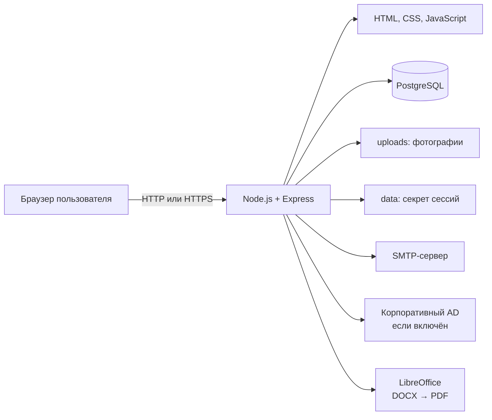

# Портфолио сотрудников

Веб-система для ведения портфолио сотрудников, проектного опыта, общего реестра проектов, проверки изменений, поиска компетенций и почтовых уведомлений.

Подробное описание ролей и пользовательских сценариев находится в [SETUP.md](SETUP.md). Этот README посвящён техническому устройству системы: установке, запуску, хранению данных, резервному копированию, восстановлению и переносу на другой компьютер.

## Содержание

1. [Что входит в систему](#что-входит-в-систему)
2. [Архитектура](#архитектура)
3. [Где хранятся данные](#где-хранятся-данные)
4. [Требования для установки](#требования-для-установки)
5. [Первый запуск через Docker](#первый-запуск-через-docker)
6. [Первый вход](#первый-вход)
7. [Обычный запуск и обновление](#обычный-запуск-и-обновление)
8. [Создание резервной копии базы](#создание-резервной-копии-базы)
9. [Восстановление базы из дампа](#восстановление-базы-из-дампа)
10. [Полный перенос на другой компьютер](#полный-перенос-на-другой-компьютер)
11. [Локальный запуск без Docker](#локальный-запуск-без-docker)
12. [Переменные окружения](#переменные-окружения)
13. [Техническая реализация](#техническая-реализация)
14. [Полезные команды](#полезные-команды)
15. [Типичные проблемы](#типичные-проблемы)

## Что входит в систему

- личные карточки сотрудников по индивидуальным ссылкам;
- общий дашборд сотрудников и поиск по компетенциям;
- проверка и история изменений портфолио;
- общий реестр проектов;
- карточки проектов руководителей проектов;
- синхронизация общих данных проекта между РП и участниками;
- импорт проектного опыта из XLS/XLSX-выгрузки УПП;
- формирование резюме DOCX и PDF;
- почтовые рассылки и уведомления участников проекта;
- локальная авторизация по электронной почте и паролю;
- возможность будущего подключения корпоративного Active Directory по LDAPS.

## Архитектура



Docker запускает три сервиса:

| Сервис | Назначение |
|---|---|
| `secrets-init` | Один раз создаёт случайный пароль подключения к PostgreSQL |
| `postgres` | Хранит рабочую базу в Docker-томе `postgres_data` |
| `app` | Запускает Node.js-приложение и публикует порт `3000` |

PostgreSQL не публикует порт `5432` наружу. Приложение подключается к нему по внутренней Docker-сети с именем хоста `postgres`.

## Где хранятся данные

### Карта хранения

| Что | Где хранится | Попадает в Git | Попадает в дамп БД |
|---|---|:---:|:---:|
| Код сайта | файлы репозитория | да | нет |
| Сотрудники, проекты и участники | Docker-том `postgres_data` | нет | да |
| Пользователи панели и хеши паролей | PostgreSQL, таблица `managers` | нет | да |
| История подтверждений | PostgreSQL | нет | да |
| Настройки SMTP и ИИ | PostgreSQL, секреты зашифрованы | нет | да |
| Сессии пользователей | PostgreSQL, таблица `sessions` | нет | да |
| Фотографии сотрудников | локальная папка `uploads/` | нет | нет |
| Секрет сессий и шифрования | `data/.session-secret` | нет | нет |
| Первоначальный пароль администратора | `data/.initial-admin-password` | нет | нет |
| Пароль подключения приложения к PostgreSQL | Docker-том `secrets_data` | нет | нет |
| Переменные запуска | `.env` | нет | нет |
| TLS-сертификаты | `certs/` | нет | нет |
| Шаблоны резюме | `templates/` | да | нет |

### Важные выводы

- Папка `data/` — не база данных.
- Изменённый пароль администратора сохраняется в PostgreSQL как bcrypt-хеш.
- Удаление контейнера не удаляет базу, пока сохранён Docker-том `postgres_data`.
- Команда `docker compose down -v` удаляет тома и рабочую базу. Не используйте её на рабочем сервере.
- Дамп PostgreSQL не содержит фотографии, `.env`, сертификаты и `.session-secret`.
- Для полного переноса недостаточно одного Git-репозитория или одного дампа.

## Требования для установки

Для рекомендуемого запуска на Windows нужны:

- Git;
- Docker Desktop с Docker Compose;
- PowerShell;
- не менее 4 ГБ свободной оперативной памяти;
- свободный TCP-порт `3000`;
- актуальный файл дампа `portfolio_backup.dump` для первого запуска новой Docker-базы.

Проверка установленного программного обеспечения:

```powershell
git --version
docker --version
docker compose version
```

LibreOffice отдельно устанавливать не нужно: он уже устанавливается внутрь Docker-образа и используется для преобразования DOCX в PDF.

## Первый запуск через Docker

### 1. Клонировать репозиторий

Замените адрес репозитория на фактический:

```powershell
git clone https://github.com/ORGANIZATION/portfolio-system.git
Set-Location .\portfolio-system
```

Если проект уже скопирован на компьютер, просто откройте PowerShell в его корневой папке.

### 2. Создать локальные каталоги

```powershell
New-Item -ItemType Directory -Force -Path .\data, .\uploads, .\backups, .\certs
```

### 3. Создать `.env`

```powershell
Copy-Item .\.env.example .\.env
notepad .\.env
```

Минимально проверьте публичный адрес:

```env
PUBLIC_BASE_URL=http://192.168.1.100:3000
```

Укажите IP или DNS-имя компьютера, доступное другим сотрудникам. Не оставляйте `localhost`, иначе ссылки из писем будут открываться только на компьютере, где запущен сайт.

Узнать IPv4-адрес Windows можно командой:

```powershell
ipconfig
```

### 4. Положить дамп в корень проекта

При первом запуске новой Docker-базы требуется непустой дамп с точным именем:

```text
portfolio_backup.dump
```

Пример копирования:

```powershell
Copy-Item 'C:\Users\User\Desktop\dumps\portfolio_backup.dump' '.\portfolio_backup.dump'
```

Проверьте наличие и размер:

```powershell
Get-Item .\portfolio_backup.dump | Select-Object FullName, Length, LastWriteTime
```

### 5. Собрать и запустить систему

```powershell
docker compose up -d --build
```

### 6. Проверить состояние

```powershell
docker compose ps
docker compose logs --tail 100 postgres
docker compose logs --tail 100 app
```

Ожидаемое состояние:

- `portfolio-postgres` — `healthy`;
- `portfolio-app` — `running`;
- сайт открывается по адресу `http://localhost:3000`;
- с другого компьютера сайт открывается по адресу из `PUBLIC_BASE_URL`.

### 7. Разрешить входящие подключения в Windows

Запустите PowerShell от имени администратора:

```powershell
New-NetFirewallRule -DisplayName 'Portfolio 3000' -Direction Inbound -Protocol TCP -LocalPort 3000 -Action Allow
```

Эта команда нужна только если сайт должен открываться с других компьютеров напрямую через порт `3000`. Для рабочего размещения рекомендуется корпоративный HTTPS reverse proxy.

## Первый вход

Страница входа:

```text
http://localhost:3000/login.html
```

Если таблица пользователей в восстановленном дампе уже заполнена, используйте почту и пароль из этой базы.

Если приложение подключено к новой пустой базе без пользователей, например при локальном запуске без Docker, оно создаёт администратора:

- почта по умолчанию — `admin@test.local`;
- случайный пароль — в `data/.initial-admin-password`.

Посмотреть первоначальный пароль:

```powershell
Get-Content .\data\.initial-admin-password
```

После первого входа смените пароль в настройках. Новый пароль сохранится в PostgreSQL и войдёт в следующий дамп базы.

## Обычный запуск и обновление

### Запустить ранее установленную систему

```powershell
docker compose up -d
```

### Остановить без удаления данных

```powershell
docker compose stop
```

### Перезапустить приложение

```powershell
docker compose restart app
```

### Забрать изменения из Git и пересобрать приложение

Сначала убедитесь, что локальные изменения сохранены:

```powershell
git status
git pull
docker compose up -d --build
docker compose ps
```

Обновление исходного кода не заменяет содержимое рабочей базы.

## Создание резервной копии базы

Резервную копию рекомендуется создавать:

- перед обновлением сайта;
- перед восстановлением другого дампа;
- перед массовым импортом;
- ежедневно на рабочем сервере;
- перед переносом системы на другой компьютер.

### Рекомендуемый способ

Запустите из корня проекта:

```powershell
powershell -ExecutionPolicy Bypass -File .\bin\backup-running-db.ps1
```

Скрипт создаст каталог `backups`, выполнит `pg_dump` внутри контейнера и сохранит файл вида:

```text
backups/portfolio_running_2026-09-01_12-30-00.dump
```

Проверьте созданный файл:

```powershell
Get-ChildItem .\backups\*.dump | Sort-Object LastWriteTime -Descending | Select-Object -First 5 FullName, Length, LastWriteTime
```

### Ручной способ

```powershell
New-Item -ItemType Directory -Force -Path .\backups
docker compose exec -T postgres pg_dump --username=portfolio --dbname=portfolio --format=custom --no-owner --no-privileges --file=/tmp/portfolio.dump
docker cp portfolio-postgres:/tmp/portfolio.dump .\backups\portfolio.dump
Get-Item .\backups\portfolio.dump | Select-Object FullName, Length, LastWriteTime
```

Формат `custom` нужен для восстановления через `pg_restore`.

### Проверить структуру дампа

```powershell
docker cp .\backups\portfolio.dump portfolio-postgres:/tmp/portfolio-check.dump
docker compose exec -T postgres pg_restore --list /tmp/portfolio-check.dump
```

Если команда выводит список таблиц и объектов без ошибки, PostgreSQL распознаёт файл как корректный custom dump.

## Восстановление базы из дампа

Есть два разных сценария.

### Сценарий A: первый запуск на новом компьютере

Этот способ применяется, только когда Docker-том `postgres_data` ещё не создавался.

1. Положите нужный дамп в корень проекта под именем `portfolio_backup.dump`.
2. Создайте `.env`, `data/`, `uploads/` и `certs/`.
3. Выполните:

```powershell
docker compose up -d --build
```

Скрипт `docker/postgres/10-restore-portfolio-backup.sh` автоматически выполнит `pg_restore` только при первоначальном создании PostgreSQL.

> Если база уже запускалась, замена `portfolio_backup.dump` не меняет рабочие данные. Используйте сценарий B.

### Сценарий B: заменить уже работающую базу

> Внимание: этот сценарий полностью заменяет сотрудников, проекты, пользователей, настройки и историю текущей базы данными из выбранного дампа.

Сначала обязательно создайте резервную копию текущей базы:

```powershell
powershell -ExecutionPolicy Bypass -File .\bin\backup-running-db.ps1
```

Затем укажите путь к восстанавливаемому файлу:

```powershell
$RestoreDump = 'C:\Users\User\Desktop\dumps\portfolio_backup.dump'
Get-Item -LiteralPath $RestoreDump | Select-Object FullName, Length, LastWriteTime
```

Остановите только приложение, оставив PostgreSQL запущенным:

```powershell
docker compose stop app
```

Скопируйте дамп в контейнер:

```powershell
docker cp $RestoreDump portfolio-postgres:/tmp/portfolio-restore.dump
```

Завершите подключения, пересоздайте базу и восстановите дамп:

```powershell
docker compose exec -T postgres psql -U portfolio -d postgres -c "SELECT pg_terminate_backend(pid) FROM pg_stat_activity WHERE datname = 'portfolio' AND pid <> pg_backend_pid();"
docker compose exec -T postgres dropdb -U portfolio --if-exists portfolio
docker compose exec -T postgres createdb -U portfolio portfolio
docker compose exec -T postgres pg_restore -U portfolio -d portfolio --exit-on-error --no-owner --no-privileges /tmp/portfolio-restore.dump
```

Запустите приложение и проверьте результат:

```powershell
docker compose up -d app
docker compose ps
docker compose logs --tail 100 postgres app
docker compose exec -T postgres psql -U portfolio -d portfolio -c "SELECT COUNT(*) AS employees FROM employees;"
```

После восстановления используются пользователи и пароли из загруженного дампа.

### Если первый запуск был выполнен без корректного дампа

Скрипт первоначальной загрузки завершится ошибкой. Если это точно новая установка и в ней ещё нет нужных данных, можно удалить созданные тома и повторить запуск:

```powershell
docker compose down -v
Copy-Item 'C:\Users\User\Desktop\dumps\portfolio_backup.dump' '.\portfolio_backup.dump' -Force
docker compose up -d --build
```

> Команда `docker compose down -v` безвозвратно удаляет рабочую базу и Docker-секреты этого проекта. Применяйте её только для неудачного первого запуска новой установки, где ещё нет данных, которые необходимо сохранить.

## Полный перенос на другой компьютер

### Что обязательно перенести

| Объект | Как переносить | Зачем |
|---|---|---|
| Исходный код | приватный Git или архив | запуск приложения |
| Актуальный `.dump` | защищённый канал, не публичный Git | сотрудники, проекты, пользователи и настройки |
| `data/.session-secret` | защищённый канал | расшифровка SMTP-пароля и API-ключа |
| `uploads/` | защищённый архив | фотографии сотрудников |
| `.env` | создать заново или передать защищённо | адрес сайта и параметры окружения |
| `certs/` | защищённый канал | HTTPS или доверенный сертификат AD |

Шаблоны из `templates/` и программный код уже переносятся через Git, если они закоммичены.

### Что переносить необязательно

- `node_modules/` — зависимости устанавливаются при сборке;
- Docker-том `secrets_data` — на новом компьютере пароль PostgreSQL будет создан автоматически;
- `data/.initial-admin-password` — при восстановлении дампа используются пользователи из базы;
- контейнеры и Docker-образы — они пересобираются из кода.

### Последовательность переноса

На старом компьютере:

```powershell
Set-Location 'C:\path\to\portfolio-system'
powershell -ExecutionPolicy Bypass -File .\bin\backup-running-db.ps1
git status
git push
```

Отдельно и безопасно скопируйте:

```text
backups/<последний-файл>.dump
data/.session-secret
uploads/
.env
certs/                    если используются
```

На новом компьютере:

```powershell
git clone https://github.com/ORGANIZATION/portfolio-system.git
Set-Location .\portfolio-system
New-Item -ItemType Directory -Force -Path .\data, .\uploads, .\backups, .\certs
```

Далее:

1. Скопируйте старый `data/.session-secret` в новую папку `data`.
2. Скопируйте содержимое `uploads/`.
3. Создайте или перенесите `.env` и измените `PUBLIC_BASE_URL` для нового адреса.
4. Положите дамп в корень с именем `portfolio_backup.dump`.
5. Запустите систему:

```powershell
docker compose up -d --build
docker compose ps
docker compose logs --tail 100 postgres app
```

### Почему нужен `.session-secret`

SMTP-пароль и API-ключ хранятся в базе в зашифрованном виде. Ключ шифрования вычисляется из `data/.session-secret`.

Если этот файл не перенести:

- сотрудники, проекты и пароли пользователей сохранятся;
- старые сессии перестанут работать;
- SMTP-пароль и API-ключ потребуется повторно ввести в настройках.

## Локальный запуск без Docker

Этот режим предназначен для разработки. Для рабочего размещения используйте Docker.

Потребуются Node.js 20 и PostgreSQL 15. Создайте базу PostgreSQL и пользователя либо используйте существующую тестовую базу.

Установите зависимости:

```powershell
npm ci
Copy-Item .\.env.example .\.env
notepad .\.env
```

Для локального PostgreSQL добавьте в `.env`:

```env
PG_HOST=localhost
PG_PORT=5432
PG_DATABASE=portfolio
PG_USER=postgres
PG_PASSWORD=ВАШ_ЛОКАЛЬНЫЙ_ПАРОЛЬ
```

Запуск:

```powershell
npm start
```

Режим разработки с автоматическим перезапуском:

```powershell
npm run dev
```

При локальном запуске сервер самостоятельно создаёт отсутствующие таблицы. Для формирования PDF LibreOffice должен быть установлен в системе и команда `soffice` должна быть доступна в `PATH`.

## Переменные окружения

Основные параметры задаются в `.env`.

| Переменная | Назначение | Типичное значение |
|---|---|---|
| `PORT` | порт приложения | `3000` |
| `PUBLIC_BASE_URL` | публичный адрес в письмах и ссылках | `https://portfolio.company.local` |
| `SESSION_COOKIE_SECURE` | передавать cookie только по HTTPS | `true` для HTTPS |
| `TRUST_PROXY` | доверять reverse proxy | `true` только за доверенным proxy |
| `TLS_CERT_PATH` | сертификат прямого HTTPS в Node.js | `/app/certs/portfolio.crt` |
| `TLS_KEY_PATH` | закрытый ключ прямого HTTPS | `/app/certs/portfolio.key` |
| `AD_ENABLED` | включить корпоративный AD | сейчас `false` |
| `AD_URL` | адрес AD | только `ldaps://...:636` |
| `AD_DOMAIN` | домен AD | `company.local` |
| `AD_ADMIN_GROUP` | группа администраторов | `Portfolio_Admins` |
| `AD_ALLOWED_GROUPS` | разрешённые группы через запятую | `Portfolio_Admins,Portfolio_Managers` |
| `AD_DEFAULT_ROLE` | роль обычного разрешённого пользователя AD | `leader` |
| `AD_ALLOW_LOCAL_FALLBACK` | разрешить локальный вход при ошибке AD | рекомендуется `false` |
| `AD_TLS_REJECT_UNAUTHORIZED` | проверять сертификат AD | `true` |

Пароль PostgreSQL при Docker-запуске генерируется автоматически. SMTP и параметры ИИ задаются администратором через интерфейс сайта, а не через публичный Git.

Для рабочего HTTPS через reverse proxy:

```env
PUBLIC_BASE_URL=https://portfolio.company.local
SESSION_COOKIE_SECURE=true
TRUST_PROXY=true
```

## Техническая реализация

### Серверная часть

- Node.js 20;
- Express;
- PostgreSQL 15;
- `pg` для работы с базой;
- `express-session` с хранением сессий в таблице `sessions`;
- `bcryptjs` для хеширования паролей;
- `nodemailer` для SMTP;
- `multer` для загрузки файлов;
- `xlsx` для импорта и экспорта таблиц;
- `docxtemplater`, `docx`, `PDFKit` и LibreOffice для документов.

Точка запуска:

```text
server/index.js
```

Конфигурация:

```text
server/config.js
```

Инициализация таблиц и методы доступа к данным:

```text
server/db.js
```

### Клиентская часть

Интерфейс находится в `public/`:

- HTML-страницы — `public/*.html`;
- стили — `public/css/styles.css`;
- логика страниц — `public/js/*.js`;
- логотипы — `public/infosoft-light.png` и `public/infosoft-dark.png`.

Сборщик клиентской части не используется: Express отдаёт эти файлы как статические ресурсы.

### База данных

Основные таблицы:

| Таблица | Назначение |
|---|---|
| `employees` | сотрудники и их портфолио |
| `projects` | общие карточки проектов и состав команды |
| `pending_changes` | изменения, ожидающие проверки |
| `approval_history` | история решений по изменениям |
| `managers` | пользователи панели и роли |
| `settings` | настройки системы, SMTP и ИИ |
| `employee_feedback` | обратная связь сотрудников |
| `sessions` | серверные пользовательские сессии |

При запуске `server/db.js` проверяет структуру и создаёт отсутствующие таблицы и столбцы. Это позволяет запускать более новую версию приложения на существующей базе без отдельного ручного SQL-скрипта, если предусмотрено соответствующее обновление схемы.

### Проекты и синхронизация

Общие данные проекта хранятся один раз в таблице `projects`. При сохранении карточки РП или администратора сервер синхронизирует связанные поля проектного опыта у участников. Сотрудник по индивидуальной ссылке не может менять управляемые проектом поля, но может редактировать разрешённые личные данные.

### Импорт УПП

Файл XLS/XLSX загружается администратором кнопкой в интерфейсе. Сервер разбирает строки, создаёт или сопоставляет проекты и добавляет проектный опыт сотрудникам. Сам файл после импорта не становится основной базой: рабочий результат сохраняется в PostgreSQL.

### Авторизация и безопасность

- локальный вход выполняется по электронной почте и паролю;
- пароли хранятся только как bcrypt-хеши;
- AD сейчас выключен и может быть подключён через LDAPS;
- сессии хранятся в PostgreSQL и действуют 8 часов;
- cookie имеют `HttpOnly` и `SameSite=Strict`;
- изменяющие запросы панели защищены проверкой источника;
- применяются ограничение частоты запросов и защитные HTTP-заголовки;
- SMTP-пароль и API-ключ шифруются AES-256-GCM;
- индивидуальные ссылки сотрудников имеют срок действия.

## Полезные команды

### Состояние контейнеров

```powershell
docker compose ps
```

### Все последние журналы

```powershell
docker compose logs --tail 200
```

### Журнал приложения

```powershell
docker compose logs --tail 200 app
```

### Журнал PostgreSQL

```powershell
docker compose logs --tail 200 postgres
```

### Следить за журналом приложения

```powershell
docker compose logs -f app
```

### Проверить готовность PostgreSQL

```powershell
docker compose exec -T postgres pg_isready -U portfolio -d portfolio
```

### Открыть `psql`

```powershell
docker compose exec postgres psql -U portfolio -d portfolio
```

Для выхода из `psql` введите:

```text
\q
```

### Посчитать сотрудников и проекты

```powershell
docker compose exec -T postgres psql -U portfolio -d portfolio -c "SELECT COUNT(*) AS employees FROM employees;"
docker compose exec -T postgres psql -U portfolio -d portfolio -c "SELECT COUNT(*) AS projects FROM projects;"
```

### Пересобрать только приложение

```powershell
docker compose up -d --build app
```

### Перезапустить все сервисы

```powershell
docker compose restart
```

### Проверить зависимости на известные уязвимости

```powershell
npm audit --omit=dev
```

### Проверить занятость порта 3000

```powershell
Get-NetTCPConnection -LocalPort 3000 -ErrorAction SilentlyContinue
```

## Типичные проблемы

### `portfolio_backup.dump` отсутствует или пустой

При первом создании Docker-базы файл обязателен. Положите корректный дамп в корень проекта и, только если это новая установка без ценных данных, пересоздайте тома по инструкции выше.

### Замена файла дампа не изменила данные

Это ожидаемо: каталог `/docker-entrypoint-initdb.d` выполняется только при создании пустого PostgreSQL-тома. Для существующей базы используйте [сценарий B](#сценарий-b-заменить-уже-работающую-базу).

### Сайт открывается только на этом компьютере

Проверьте:

- `PUBLIC_BASE_URL` содержит реальный IP или DNS-имя, а не `localhost`;
- порт `3000` разрешён в Windows Firewall;
- компьютеры находятся в доступной сети;
- Docker публикует порт `3000:3000`.

### После переноса не работает SMTP или ИИ

Вероятнее всего, не был перенесён старый `data/.session-secret`. Введите SMTP-пароль и API-ключ повторно в настройках либо верните исходный `.session-secret`.

### После восстановления не подходит пароль администратора

Дамп восстанавливает таблицу `managers`, поэтому действует пароль, который был установлен в этой базе на момент создания дампа. Файл `.initial-admin-password` не меняет пароль пользователя из восстановленной базы.

### Ошибка `column ... does not exist`

Проверьте журнал приложения:

```powershell
docker compose logs --tail 200 app
```

Затем убедитесь, что используется актуальный код и выполнена пересборка:

```powershell
git pull
docker compose up -d --build app
```

Если ошибка остаётся, сначала создайте дамп и только после этого проверяйте совместимость структуры восстановленной базы с текущей версией `server/db.js`.

## Безопасность Git

Не добавляйте в публичный репозиторий:

```text
.env
data/
uploads/
certs/
backups/
*.dump
реальные выгрузки УПП
```

Дамп содержит персональные данные и хеши паролей. Передавайте его только защищённым способом.

Если дамп уже отслеживается Git, правило `.gitignore` само его не удалит. Уберите файл из текущего индекса, сохранив локальную копию:

```powershell
git rm --cached -- portfolio_backup.dump
git commit -m "Stop tracking database dump"
```

Если дамп попадал в публичную историю Git, одного `git rm --cached` недостаточно: необходимо закрыть доступ к данным, очистить историю репозитория и заменить потенциально раскрытые секреты.
