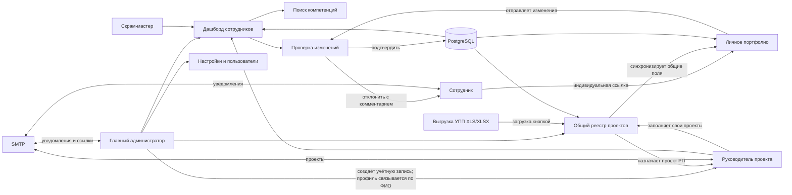
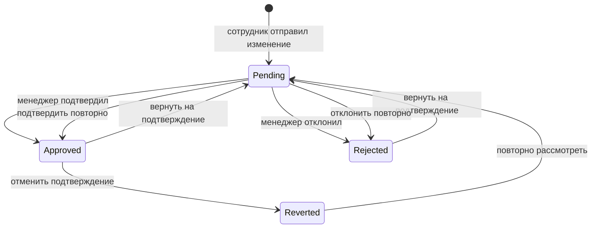
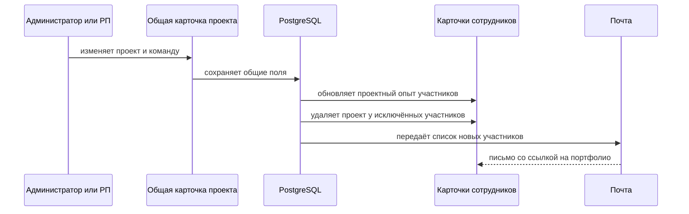
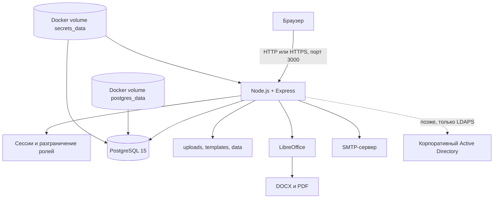
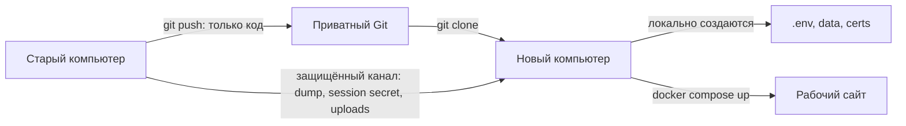

# Портфолио сотрудников — устройство, роли и запуск системы

Этот документ описывает текущую реализацию сайта: из каких компонентов он состоит, какие пользователи в нём работают, что разрешено каждой роли, как проходят изменения портфолио и проектов, где хранятся данные и как развернуть систему из Git.

Документ соответствует состоянию проекта на 1 сентября 2026 года.

## Содержание

1. [Назначение системы](#назначение-системы)
2. [Участники и роли](#участники-и-роли)
3. [Общая схема взаимодействия](#общая-схема-взаимодействия)
4. [Работа главного администратора](#работа-главного-администратора)
5. [Работа скрам-мастера](#работа-скрам-мастера)
6. [Работа руководителя проекта](#работа-руководителя-проекта)
7. [Работа сотрудника](#работа-сотрудника)
8. [Подтверждение изменений](#подтверждение-изменений)
9. [Проекты и синхронизация с портфолио](#проекты-и-синхронизация-с-портфолио)
10. [Импорт проектного опыта из УПП](#импорт-проектного-опыта-из-упп)
11. [Поиск сотрудников по компетенциям](#поиск-сотрудников-по-компетенциям)
12. [Почтовые уведомления](#почтовые-уведомления)
13. [Архитектура и хранение данных](#архитектура-и-хранение-данных)
14. [Запуск через Docker](#запуск-через-docker)
15. [Первый вход и смена пароля](#первый-вход-и-смена-пароля)
16. [Перенос проекта через Git](#перенос-проекта-через-git)
17. [Резервное копирование и восстановление](#резервное-копирование-и-восстановление)
18. [Подключение корпоративного Active Directory](#подключение-корпоративного-active-directory)
19. [Безопасность и эксплуатация](#безопасность-и-эксплуатация)
20. [Полезные команды](#полезные-команды)

## Назначение системы

Система хранит портфолио сотрудников и общий реестр проектов. Она решает пять основных задач:

- сотрудник самостоятельно актуализирует личное портфолио по индивидуальной ссылке;
- менеджер проверяет и подтверждает изменения сотрудника;
- главный администратор ведёт общий список сотрудников и проектов;
- руководитель проекта заполняет проект один раз, после чего данные автоматически попадают всем действующим участникам;
- менеджеры ищут сотрудников по ФИО, должности, городу, компетенциям и проектному опыту.

Основные страницы:

| Страница | Назначение | Кто использует |
|---|---|---|
| `/login.html` | Вход в панель управления | администратор, скрам-мастер, РП |
| `/index.html` | Дашборд сотрудников, поиск и действия | администратор, скрам-мастер |
| `/review.html` | Проверка предложенных изменений | администратор, скрам-мастер |
| `/history.html` | История решений и повторная обработка | администратор, скрам-мастер |
| `/projects.html` | Реестр проектов | администратор видит все, РП — только закреплённые за ним |
| `/project.html` | Полная карточка отдельного проекта | администратор или назначенный РП |
| `/settings.html` | Настройки, пользователи, почта и шаблоны | набор разделов зависит от роли |
| `/form.html?token=...` | Индивидуальная анкета сотрудника | сотрудник |

## Участники и роли

В системе существуют две группы пользователей: пользователи панели управления и сотрудники с индивидуальными ссылками.

### Роли панели управления

Роли панели хранятся в таблице `managers`.

| Роль | Код | Основные права |
|---|---|---|
| Главный администратор | `admin` | полный доступ к сотрудникам, проектам, настройкам, пользователям, импорту, рассылкам и истории |
| Скрам-мастер / проверяющий менеджер | `scrum` | просмотр и редактирование сотрудников, проверка изменений, поиск, импорт и экспорт сотрудников, рассылки |
| Руководитель проекта (РП) | `leader` | все права скрам-мастера по сотрудникам и проверке изменений; дополнительно видит и редактирует только закреплённые за ним проекты |

### Сотрудники и РП

Сотрудники хранятся в таблице `employees` и открывают анкету по персональному токену без логина и пароля.

У сотрудника может быть признак `is_rp = true`. Для входа РП главный администратор создаёт пользователя панели с ролью `leader` и указывает ФИО точно как в существующем профиле сотрудника. Система сама находит профиль по ФИО, связывает его с учётной записью и устанавливает признак `is_rp`.

> Роль `leader` обязательно связана с действующим сотрудником. Это связывание определяет, какие проекты доступны после входа.

### Матрица прав

| Действие | Администратор | Скрам-мастер | РП (`leader`) | Сотрудник по ссылке |
|---|:---:|:---:|:---:|:---:|
| Вход в панель управления | ✓ | ✓ | ✓ | — |
| Просмотр списка сотрудников | ✓ | ✓ | ✓ | только свои данные |
| Поиск компетенций | ✓ | ✓ | ✓ | — |
| Прямое редактирование сотрудника | ✓ | ✓ | ✓ | — |
| Подтверждение и отклонение изменений | ✓ | ✓ | ✓ | — |
| Создание учётной записи РП с привязкой к профилю сотрудника | ✓ | — | — | — |
| Реестр проектов | все проекты | — | только свои проекты | — |
| Создание проекта | ✓ | — | — | — |
| Назначение РП проекту | ✓ | — | — | — |
| Изменение общей карточки проекта | ✓ | — | только закреплённого проекта | — |
| Изменение личной даты и роли в проектном опыте | ✓ | ✓ | как участник | ✓ |
| Настройка SMTP, ИИ и пользователей | ✓ | — | — | — |
| Массовая рассылка | ✓ | ✓ | ✓ | — |

## Общая схема взаимодействия



## Работа главного администратора

Главный администратор входит по электронной почте и паролю через `/login.html`.

### На дашборде сотрудников

Администратор может:

- искать сотрудников по ФИО, должности, городу, компетенциям, технологиям и проектам;
- фильтровать по должности, городу, сертификатам, признаку РП и архивному статусу;
- создавать и редактировать карточки сотрудников;
- архивировать, восстанавливать и безвозвратно удалять архивных сотрудников;
- создавать учётную запись РП; существующий профиль автоматически находится и связывается по ФИО, а признак РП устанавливается без действий на дашборде;
- создавать новую индивидуальную ссылку сотрудника;
- выгружать резюме в DOCX/PDF и данные в Excel;
- отправлять массовую рассылку выбранным сотрудникам;
- переходить к изменениям, ожидающим подтверждения, и истории решений.

### На вкладке «Проекты»

Администратор может:

- создать проект;
- загрузить проектный опыт из файла УПП;
- назначить или заменить РП;
- снять РП с проекта, выбрав значение «Не назначен»;
- заполнить и изменить все общие поля проекта;
- выбрать функциональные блоки чекбоксами;
- добавить действующих сотрудников в команду;
- отправить выбранные проекты назначенным РП;
- архивировать проекты;
- выгрузить регистр проектного опыта в Excel.

### В настройках

Администратор управляет:

- SMTP и отправителем писем;
- параметрами ИИ-проверки текста;
- пользователями панели и их ролями;
- должностями, псевдонимами должностей и компетенциями;
- шаблоном DOCX;
- собственным паролем.

После смены пароля все активные сессии этого пользователя завершаются. Необходимо войти повторно.

## Работа скрам-мастера

Скрам-мастер входит через `/login.html` и работает с портфолио сотрудников.

Он может:

- просматривать сотрудников и пользоваться поиском компетенций;
- создавать, редактировать, архивировать и восстанавливать сотрудников;
- подтверждать или отклонять отдельные поля и весь набор изменений сотрудника;
- работать с историей решений;
- формировать резюме и выгрузки;
- импортировать сотрудников из Excel в режиме добавления;
- выполнять массовую рассылку;
- редактировать справочники должностей и компетенций;
- пользоваться ИИ-инструментами проверки текста.

Он не может:

- открывать административную вкладку проектов;
- назначать или снимать РП;
- безвозвратно удалять сотрудника;
- полностью заменять базу сотрудников импортом;
- управлять другими пользователями, SMTP, ИИ-ключами и шаблоном DOCX.

## Работа руководителя проекта

РП — это действующий сотрудник, для которого главный администратор создал учётную запись панели с ролью «Руководитель проекта (РП)». Профиль и признак РП назначаются автоматически по совпадению ФИО.

РП работает через личный кабинет:

1. Входит через `/login.html` по почте и паролю.
2. Попадает на дашборд сотрудников и может работать с портфолио на тех же правах, что и скрам-мастер.
3. Через кнопку «Мои проекты» открывает `/projects.html`.
4. Видит только проекты, где его связанный `employee_id` указан как `leader_employee_id`.
5. Открывает проект на редактирование, заполняет общие данные и состав команды.
6. Сохраняет карточку.

РП другого проекта не видит закрытые данные проекта, который за ним не закреплён. Сервер дополнительно проверяет принадлежность проекта РП, поэтому подмена номера проекта в адресе не даёт доступа.

РП может заполнить:

- название проекта;
- название в резюме;
- юридическое название заказчика;
- описание компании или вида деятельности;
- описание проекта;
- функциональную область;
- функциональные блоки;
- начало и конец периода либо «настоящее время»;
- полное количество участников;
- программные продукты и технологии;
- список действующих участников проекта.

При сохранении проекта:

- общие данные синхронизируются в проектном опыте всех участников;
- новый участник получает проект в своём портфолио;
- удалённый из команды участник теряет связанную запись проекта;
- письма РП и участникам не отправляются;
- выбранные функциональные блоки добавляются строкой `Функциональные блоки: ...` в описание проекта у всех участников.

## Работа сотрудника

Сотрудник не входит через `/login.html`. Он получает индивидуальную ссылку вида:

```text
http://адрес-сайта:3000/form.html?token=персональный-токен
```

Токен действует 180 дней. Администратор или скрам-мастер может выпустить новую ссылку; старая после этого перестаёт работать.

Сотрудник может редактировать:

- ФИО;
- образование;
- должность;
- контакты;
- общий опыт;
- раздел «Обо мне»;
- компетенции;
- сертификаты и обучение;
- фотографию;
- свой период участия, должность и роль внутри проектного опыта;
- обратную связь о работе с системой.

В связанном с общей карточкой проекте сотрудник не может изменять:

- количество участников;
- название проекта или название в резюме;
- заказчика и отрасль;
- описание проекта;
- функциональную область;
- программные продукты и технологии;
- функциональные блоки.

Эти общие поля отображаются как нередактируемые и дополнительно защищены на сервере. Период сначала наследуется из проекта. После изменения сотрудником он становится личным и больше не перезаписывается при изменении периода РП. На дашборде проектов отображается проверка совпадения, отсутствия или индивидуальности дат участников.

После нажатия «Отправить» изменения сотрудника не заменяют утверждённое портфолио сразу. Они попадают в очередь на подтверждение.

## Подтверждение изменений



Статусы решений:

- `pending` — ожидает подтверждения;
- `approved` — новое значение принято и записано в карточку сотрудника;
- `rejected` — изменение отклонено, при необходимости сохраняется комментарий;
- отменённое подтверждение не является отдельным статусом: в истории у записи фиксируется факт отмены.

Проверяющий может:

- развернуть конкретное поле и сравнить старое и новое значение;
- подтвердить или отклонить отдельное поле;
- подтвердить или отклонить все изменения сотрудника;
- выбрать дату в истории;
- отменить ранее подтверждённое изменение, если поле после этого не менялось;
- вернуть подтверждённое или отклонённое решение в очередь;
- повторно подтвердить либо отклонить запись из истории.

Когда все поля сотрудника обработаны, система отправляет ему итоговое письмо с перечнем принятых и отклонённых полей.

## Проекты и синхронизация с портфолио

### Поля общей карточки проекта

| Поле | Назначение |
|---|---|
| Название проекта | внутреннее название проекта и ключ сопоставления при импорте УПП |
| Руководитель проекта | действующий сотрудник с признаком РП |
| Название в резюме | обезличенное или согласованное название для резюме |
| Юридическое название заказчика | фактическое юридическое лицо; доступно администратору и РП |
| Описание компании / вида деятельности | обезличенный заказчик для резюме, например «крупная нефтяная компания» |
| Описание проекта | общее описание выполненных работ и назначения проекта |
| Функциональные блоки | выбранные чекбоксы, автоматически включаемые в описание |
| Функциональная область | сведения из УПП или уточнение РП |
| Период | начало, окончание или отметка «настоящее время» |
| Количество участников | полная численность, включая уже уволенных сотрудников |
| Команда проекта | только найденные действующие сотрудники |
| Технологии | программные продукты, платформы и интеграции |

### Правила счётчика команды

- при ручном добавлении сотрудника РП или администратором счётчик увеличивается на `1`;
- при ручном удалении сотрудника счётчик уменьшается на `1`, но не ниже нуля;
- при импорте УПП счётчик устанавливается в полное количество уникальных участников, включая уволенных;
- список команды и числовой счётчик являются разными данными.

### Как выполняется синхронизация



Общие данные проекта хранятся один раз в таблице `projects`. Представление проекта в `employees.project_experience` синхронизируется при сохранении проекта. Благодаря этому изменение даты, заказчика, технологий, команды или описания у администратора/РП распространяется на всех участников.

## Импорт проектного опыта из УПП

Импорт запускает только главный администратор кнопкой на вкладке «Проекты». Файл не загружается автоматически при запуске сайта.

Допустимые форматы: `.xls` и `.xlsx`, максимальный размер — 20 МБ.

### Обязательные колонки

| Колонка УПП | Куда записывается |
|---|---|
| `Сотрудник` | поиск или создание сотрудника, состав команды |
| `Функциональная область` | функциональная область проекта и участника |
| `Программный продукт` | технологии проекта и участника |
| `Название` или `Проект` | название проекта |
| `Дата начала` | начало периода проекта |
| `Дата окончания` | конец периода проекта |

### Необязательные колонки

| Колонка УПП | Использование |
|---|---|
| `Ссылка` | сохраняется как источник строки |
| `НомерСтроки` | сохраняется для обратной выгрузки регистра |
| `Должность` | записывается в поле «Роль» участника в проекте |
| `ДатаВхода` | начало участия конкретного сотрудника |
| `ДатаВыхода` | окончание участия конкретного сотрудника |

Колонки `Опыт` и `Основной консультант` при импорте не используются.

### Обработка действующих и уволенных сотрудников

- жёлтая заливка ячейки с именем означает неработающего сотрудника;
- такой сотрудник не добавляется в действующую команду проекта;
- он учитывается в полном числовом размере команды;
- если сотрудник встречается только в жёлтых строках, его существующая карточка переводится в архив;
- проект создаётся, если в нём есть хотя бы одна активная строка;
- участники сопоставляются по нормализованному ФИО;
- проекты сопоставляются по названию без учёта регистра и лишних пробелов.

После импорта система создаёт или обновляет проекты и автоматически синхронизирует проектный опыт действующих участников.

## Поиск сотрудников по компетенциям

Поиск находится на дашборде. Запрос разбивается на отдельные слова, и сотрудник попадает в результат, если все слова присутствуют хотя бы в одном из индексируемых источников.

Поиск учитывает:

- ФИО;
- должность;
- город;
- электронную почту;
- компетенции;
- название проекта;
- роль и должность в проекте;
- функциональные блоки и функциональную область;
- технологии;
- описание проекта;
- заказчика и период.

Например, запросы `Казначейство`, `Документооборот`, `1С ERP` или `РП Новосибирск` помогают подобрать сотрудников с нужным опытом. В строке сотрудника выводятся совпавшие компетенции и проекты.

Дополнительные фильтры позволяют ограничить список должностью, городом, сертификатами, признаком РП и архивным статусом.

## Почтовые уведомления

Для отправки писем главный администратор заполняет SMTP в настройках. Почта пользователя, вошедшего в панель, автоматически используется как адрес отправителя/ответа в разрешённых сценариях.

Система отправляет письма в следующих случаях:

| Событие | Получатель | Содержание |
|---|---|---|
| Сотрудник отправил изменения | проверяющий менеджер | ФИО, должность и ссылка «Проверить изменения» |
| Изменения отправлены | сотрудник | подтверждение постановки в очередь |
| Проверка завершена | сотрудник | перечень принятых и отклонённых полей |
| Массовая рассылка | выбранные сотрудники | текст администратора/скрам-мастера с персональными подстановками |

В массовой рассылке поддерживаются подстановки:

```text
{{name}}      — имя
{{fullName}}  — полное ФИО
{{position}}  — должность
{{city}}      — город
{{link}}      — индивидуальная ссылка
```

Если SMTP не настроен, основная операция сохранения не отменяется, но письмо не отправляется.

## Архитектура и хранение данных



### Таблицы PostgreSQL

| Таблица | Что хранит |
|---|---|
| `employees` | сотрудники, портфолио, токены, статус и признак РП |
| `projects` | общие карточки проектов, РП, команда, источник УПП |
| `pending_changes` | изменения сотрудников, ожидающие решения |
| `approval_history` | журнал подтверждений, отклонений и возвратов |
| `managers` | пользователи панели, роли и bcrypt-хеши паролей |
| `settings` | SMTP, ИИ и справочники; чувствительные значения зашифрованы |
| `employee_feedback` | оценка и комментарий сотрудника |
| `sessions` | активные сессии пользователей панели |

### Где физически находятся данные

| Данные | Место хранения | Попадают в Git |
|---|---|:---:|
| Рабочая PostgreSQL | Docker volume `postgres_data` | нет |
| Пароль PostgreSQL | Docker volume `secrets_data` | нет |
| Хеш пароля администратора | таблица `managers` | только внутри дампа БД |
| Секрет сессии | `data/.session-secret` | нет |
| Первоначальный пароль новой установки | `data/.initial-admin-password` | нет |
| Временный пароль после ротации | `data/.admin-reset-password.json` | нет |
| Загруженные фотографии | `uploads/` | нет |
| TLS-сертификаты | `certs/` | нет |
| Резервные копии | `backups/*.dump` | нет |

Папки `data`, `uploads`, `certs`, `backups` и файлы `*.dump` намеренно исключены из Git.

## Запуск через Docker

Docker — основной способ запуска системы. Отдельно устанавливать Node.js или PostgreSQL не требуется.

### Требования

- Windows 10/11 или Linux;
- Docker Desktop либо Docker Engine с Compose;
- минимум 4 ГБ свободной оперативной памяти;
- свободный порт `3000`;
- доступ к SMTP нужен только для писем.

### 1. Клонирование

```powershell
git clone <адрес-репозитория>
cd portfolio-system
```

### 2. Локальные каталоги

В PowerShell:

```powershell
New-Item -ItemType Directory -Force .\data, .\uploads, .\certs, .\backups
```

На Linux перед запуском дайте контейнерному пользователю Node.js право записи в `data` и `uploads`:

```bash
mkdir -p data uploads certs backups
sudo chown -R 1000:1000 data uploads
```

### 3. Настройки окружения

```powershell
Copy-Item .env.example .env
```

Минимальный `.env` для локальной сети:

```env
PORT=3000
PUBLIC_BASE_URL=http://192.168.1.100:3000
SESSION_COOKIE_SECURE=false
TRUST_PROXY=false

AD_ENABLED=false
```

В `PUBLIC_BASE_URL` укажите адрес компьютера, доступный другим пользователям. Не используйте `localhost` в рабочей рассылке: такая ссылка открывается только на том же компьютере.

### 4. Исходная база

Файл `portfolio_backup.dump` используется только при первом создании пустого тома PostgreSQL. Он должен лежать в корне проекта до первого запуска.

Этот файл содержит персональные данные. Передавайте его отдельно от публичного Git — через защищённое корпоративное хранилище.

Если том `postgres_data` уже существует, PostgreSQL пропускает начальное восстановление и продолжает работать с текущими данными.

### 5. Запуск

```powershell
docker compose up -d --build
```

Проверка:

```powershell
docker compose ps
docker compose logs --tail 100 app
```

Ожидаемое состояние:

- `portfolio-app` — `running`;
- `portfolio-postgres` — `healthy`;
- наружу опубликован только порт `3000`;
- порт контейнерной PostgreSQL `5432` доступен только внутри Docker-сети.

## Первый вход и смена пароля

При пустой таблице `managers` приложение создаёт первоначального администратора.

- стандартная почта без дополнительных настроек: `admin@test.local`;
- случайный первоначальный пароль записывается локально в `data/.initial-admin-password`;
- пароль не выводится в Docker-журнал и не добавляется в Git.

Откройте:

```text
http://localhost:3000/login.html
```

После входа перейдите в «Настройки» → «Смена пароля». Минимальная длина — 12 символов. Новый пароль сохраняется в таблице `managers` как bcrypt-хеш, а текущие сессии завершаются.

Если база восстановлена из дампа, используются логины и пароли из восстановленной базы. Файл `.initial-admin-password` не меняет пароль уже существующего администратора.

## Перенос проекта через Git

Git переносит исходный код, но не переносит рабочую базу и локальные секреты.

### Что отправлять в Git

- исходный код;
- `Dockerfile` и `docker-compose.yml`;
- `package.json` и `package-lock.json`;
- `.env.example` без реальных паролей;
- шаблоны и статические файлы, не содержащие персональных данных.

### Что не отправлять в Git

- `.env`;
- `data/`;
- `uploads/`;
- `certs/`;
- `backups/` и любые `*.dump`;
- SMTP-пароли, API-ключи и сертификаты;
- реальные выгрузки УПП.

Если дамп уже был добавлен в индекс Git до появления правила `.gitignore`, уберите его только из индекса, сохранив локальный файл:

```powershell
git rm --cached -- portfolio_backup.dump
git commit -m "Stop tracking database dump"
```

`.gitignore` не удаляет файл из прошлой истории репозитория. Если дамп уже попадал в публичный репозиторий, считайте содержащиеся в нём данные раскрытыми: закройте доступ к репозиторию и отдельно выполните очистку истории и ротацию секретов.

### Полный перенос рабочего сайта



Последовательность:

1. Создать актуальный дамп базы на старом компьютере.
2. Отправить код в приватный Git без дампа и секретов.
3. Клонировать репозиторий на новом компьютере.
4. Передать дамп отдельно защищённым способом.
5. Защищённо перенести `data/.session-secret`; он нужен для расшифровки SMTP-пароля и API-ключа из восстановленной БД.
6. При необходимости перенести `uploads/`, чтобы сохранить фотографии сотрудников.
7. Создать локальный `.env`, каталоги и добавить корпоративные TLS-сертификаты.
8. Восстановить базу.
9. Запустить контейнеры.

Пароль администратора находится в PostgreSQL. Поэтому после восстановления дампа используется тот же пароль, который был на старом сервере.

Если `data/.session-secret` потерян, пароли администраторов продолжат работать, но зашифрованные SMTP/API-настройки потребуется ввести повторно. Не публикуйте этот файл в Git.

## Резервное копирование и восстановление

### Создание дампа работающей базы

В проекте есть готовый PowerShell-скрипт:

```powershell
powershell -ExecutionPolicy Bypass -File .\bin\backup-running-db.ps1
```

Результат появится в папке `backups` с именем вида:

```text
portfolio_running_2026-09-01_12-30-00.dump
```

Ручной способ:

```powershell
docker compose exec -T postgres pg_dump -U portfolio -d portfolio -Fc -f /tmp/portfolio.dump
docker cp portfolio-postgres:/tmp/portfolio.dump .\backups\portfolio.dump
```

### Восстановление существующей базы

> Внимание: команды ниже заменяют содержимое рабочей базы. Перед восстановлением обязательно создайте свежий дамп.

```powershell
docker compose stop app
docker cp .\backups\portfolio.dump portfolio-postgres:/tmp/portfolio.dump
docker compose exec -T postgres psql -U portfolio -d postgres -c "SELECT pg_terminate_backend(pid) FROM pg_stat_activity WHERE datname = 'portfolio' AND pid <> pg_backend_pid();"
docker compose exec -T postgres dropdb -U portfolio --if-exists portfolio
docker compose exec -T postgres createdb -U portfolio portfolio
docker compose exec -T postgres pg_restore -U portfolio -d portfolio --no-owner --no-privileges /tmp/portfolio.dump
docker compose up -d app
```

После восстановления проверьте:

```powershell
docker compose ps
docker compose logs --tail 100 postgres app
```

## Подключение корпоративного Active Directory

Сейчас AD выключен, используется локальная авторизация по электронной почте и паролю.

Для подключения корпоративного AD потребуются:

- адрес контроллера домена по `LDAPS`;
- домен;
- названия разрешённых групп;
- отдельная административная группа;
- сертификат корпоративного центра сертификации;
- согласование соответствия групп ролям системы.

Пример будущей конфигурации:

```env
AD_ENABLED=true
AD_URL=ldaps://ad.company.local:636
AD_DOMAIN=company.local
AD_ADMIN_GROUP=Portfolio_Admins
AD_ALLOWED_GROUPS=Portfolio_Admins,Portfolio_Managers
AD_DEFAULT_ROLE=leader
AD_ALLOW_LOCAL_FALLBACK=false
AD_TLS_REJECT_UNAUTHORIZED=true
AD_TLS_CA_PATH=/app/certs/company-ca.crt
```

Порядок входа при включённом AD:

1. Сервер проверяет пароль через LDAPS.
2. Проверяет принадлежность хотя бы к одной разрешённой группе.
3. Участник административной группы получает роль `admin`.
4. Остальные разрешённые пользователи получают `AD_DEFAULT_ROLE`.
5. При первом входе создаётся локальная запись менеджера без сохранения пароля AD.
6. При изменении группы локальная роль синхронизируется на следующем входе.

Незащищённый `ldap://`, отключение проверки сертификата и тестовый Samba AD в рабочем окружении не используются.

## Безопасность и эксплуатация

В текущей конфигурации:

- пароли пользователей хранятся только как bcrypt-хеши;
- пароль PostgreSQL создаётся случайно в отдельном Docker-томе;
- SMTP-пароль и API-ключ ИИ шифруются перед записью в БД;
- сессии имеют `HttpOnly`, `SameSite=Strict` и срок жизни 8 часов;
- после входа идентификатор сессии заменяется;
- изменяющие запросы панели защищены проверкой источника;
- попытки входа и обращения к API ограничены по частоте;
- загружаемые файлы ограничены типом, количеством и размером;
- приложение запускается не от `root`, Linux capabilities отключены;
- PostgreSQL не публикуется наружу через Docker;
- индивидуальные токены сотрудников имеют срок действия 180 дней;
- `mode=manager` работает только при действующей сессии администратора или скрам-мастера.

Для рабочего размещения рекомендуется HTTPS. Варианты:

1. корпоративный reverse proxy с доверенным сертификатом;
2. прямой TLS в Node.js через `TLS_CERT_PATH` и `TLS_KEY_PATH`.

При HTTPS установите:

```env
PUBLIC_BASE_URL=https://portfolio.company.local
SESSION_COOKIE_SECURE=true
TRUST_PROXY=true
```

`TRUST_PROXY=true` нужен только при доверенном reverse proxy. Не включайте его для прямого доступа к Node.js из недоверенной сети.

## Полезные команды

### Статус

```powershell
docker compose ps
```

### Журналы

```powershell
docker compose logs --tail 200 app
docker compose logs --tail 200 postgres
```

### Пересборка после изменения кода

```powershell
docker compose up -d --build app
```

### Перезапуск приложения

```powershell
docker compose restart app
```

### Проверка PostgreSQL

```powershell
docker compose exec -T postgres pg_isready -U portfolio
```

### Проверка зависимостей

```powershell
npm audit --omit=dev
```

### Остановка без удаления данных

```powershell
docker compose stop
```

### Запуск после остановки

```powershell
docker compose up -d
```

Не используйте `docker compose down -v`, если не хотите удалить рабочие Docker-тома с базой и секретом PostgreSQL.
